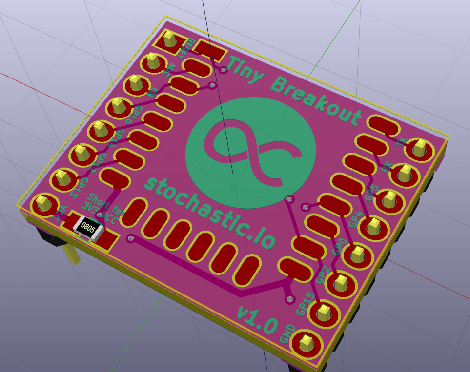
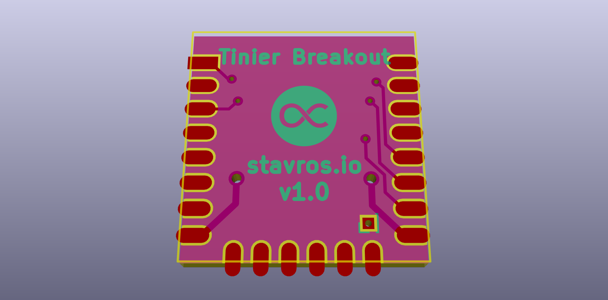
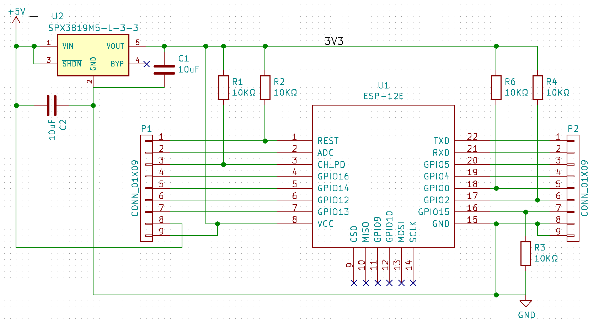

# Tiny ESP8266 Breakout Board

This is a tiny ESP8266 breakout board. I made it because the small breakouts I
bought took up the entire breadboard and didn't include basic pullup/pulldown
resistors.

## Ready-made PCB

If you just want to buy the PCB directly, here's [a paneled v1.4
version from Dirty
PCBs](http://dirtypcbs.com/view.php?share=17018&accesskey=47b880c9e762ffa555ab1070dc1a2dde),
which includes 40 breakouts for $14. Note that the boards come without
components, and you'll have to solder them yourself. You'll need:

* [0805 SMD 10k Ohm
  resistors](https://www.aliexpress.com/item/0805-SMD-Resistor-5-10K-ohm-5000pcs-lot/32307395708.html)
* [0805 SMD 22 uF
  capacitors](https://www.aliexpress.com/item/SMD-ceramic-capacitor-2012-0805-22-uf-6-3-V-100-PCS/32768384675.html)
* [SPX3819M5-L-3-3 TR 3.3V SMD
  LDO](https://www.aliexpress.com/item/10PCS-SPX3819M5-SPX3819M5-3-3-SPX3819M5-L-3-3-TR-SOT-23-5/32522603067.html)
* [Male pin headers
  (optional)](https://www.aliexpress.com/item/Free-Shipping-10pcs-40-Pin-1x40-Single-Row-Male-2-54-Breakable-Pin-Header-Connector-Strip/32416951874.html)

If any of the links above aren't working, just search your favorite site for the
components or visit your local electronics shop, they should have all of these.

You can use these ESP8266 versions with this PCB:

* ESP-07
* ESP-12
* ESP-12E
* ESP-12Q
* ESP-12F
* ESP-14

## License

Use the board however you want, it's under the BSD license, here's what it looks
like:

The files are standard KiCad files, go nuts.

Stavros
