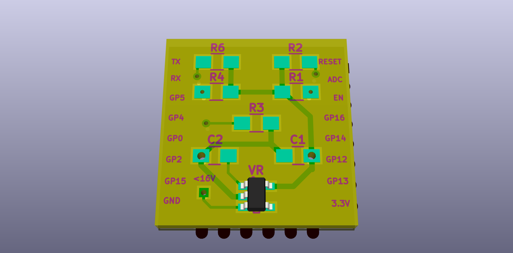

# Tiny ESP8266 Breakout Board

This is a tiny ESP8266 breakout board. I made it because the small breakouts I
bought took up the entire breadboard and didn't include basic pullup/pulldown
resistors.

## Ready-made PCB

If you just want to buy the PCB directly, here's [a paneled v1.4
version from Dirty
PCBs](http://dirtypcbs.com/view.php?share=17018&accesskey=47b880c9e762ffa555ab1070dc1a2dde),
which includes 40 breakouts for $14. Note that the boards come without
components, and you'll have to solder them yourself. You'll need:

* [0805 SMD 10k Ohm resistors](http://www.ebay.com/itm/291627440605)
* [0805 SMD 22 uF capacitors](http://www.ebay.com/itm/221402799749)
* [SPX3819M5-L-3-3 TR 3.3V SMD LDO](http://www.ebay.com/itm/261960469018)
* [Male pin headers (optional)](http://www.ebay.com/itm/381375094139)

If any of the links above aren't working, just search your favorite site for the
components or visit your local electronics shop, they should have all of these.

## License

Use the board however you want, it's under the BSD license, here's what it looks
like:

The files are standard KiCad files, go nuts.

Stavros
